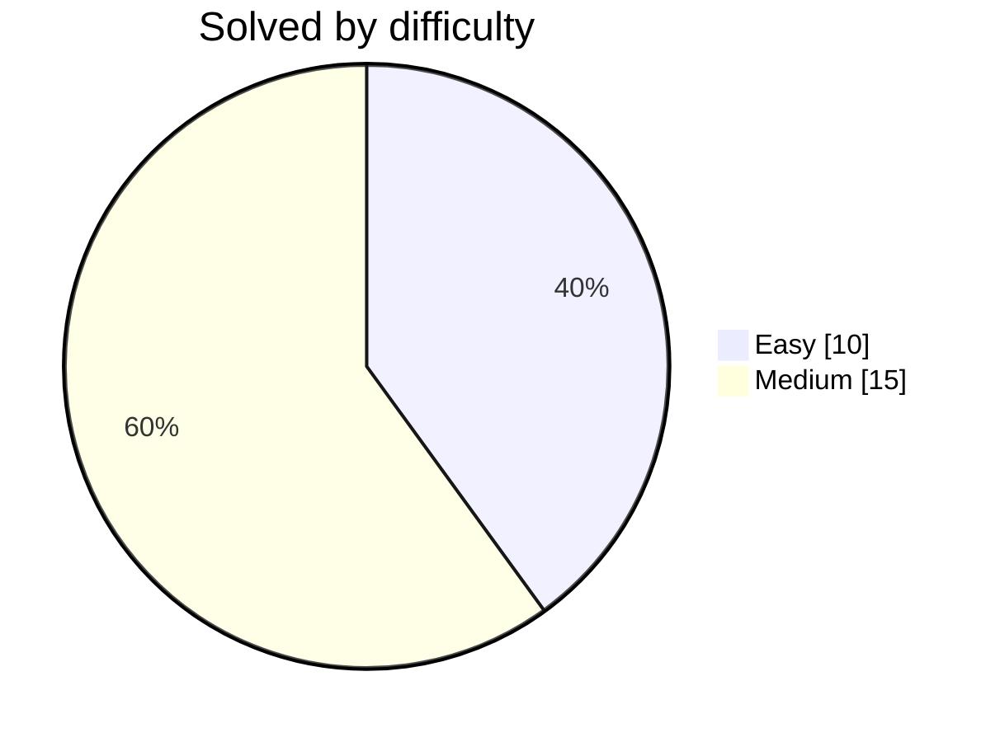

# 🐸 DwijeshD's Coding Solutions

**Accepted submissions, auto-committed by [LeetFrog](https://github.com/DwijeshD/LeetFrog)** 🐸

  
  

  
  
  

  

  
  
  
  

## 🟠 LeetCode  ·  25

| # | Problem | Difficulty | Language | Commit | Synced |
|:--:|:--|:--:|:--:|:--:|:--:|
| 1 | **[Longest Common Prefix](leetcode/longest-common-prefix/)** |  |  | [latest](https://github.com/DwijeshD/leetcode-solutions) | `2026-08-21` |
| 2 | **[Subarray Sum Equals K](leetcode/subarray-sum-equals-k/)** |  |  | [`bd5136b`](https://github.com/DwijeshD/leetcode-solutions/commit/bd5136bbf08c2841fa800baa396b2050dc66a53c) ↺3 | `2026-08-20` |
| 3 | **[Word Pattern](leetcode/word-pattern/)** |  |  | [`6bcd499`](https://github.com/DwijeshD/leetcode-solutions/commit/6bcd499a6a5d91ac6895de1e57fba8e63b6e78cc) ↺69 | `2026-08-18` |
| 4 | **[Binary Tree Zigzag Level Order Traversal](leetcode/binary-tree-zigzag-level-order-traversal/)** |  |  | [`d2c201e`](https://github.com/DwijeshD/leetcode-solutions/commit/d2c201e675bf73cec6499615248c5ba5cea82382) | `2026-08-16` |
| 5 | **[Binary Tree Level Order Traversal](leetcode/binary-tree-level-order-traversal/)** |  |  | [`32180c7`](https://github.com/DwijeshD/leetcode-solutions/commit/32180c7d793c9b4286d2d3d062a82bae2acdfa0e) ↺22 | `2026-08-16` |
| 6 | **[Widest Vertical Area Between Two Points Containing No Points](leetcode/widest-vertical-area-between-two-points-containing-no-points/)** |  |  | [`0e29946`](https://github.com/DwijeshD/leetcode-solutions/commit/0e299462403ccdea2358499acc7099dfb972739e) | `2026-08-13` |
| 7 | **[Sequential Digits](leetcode/sequential-digits/)** |  |  | [`cd1c563`](https://github.com/DwijeshD/leetcode-solutions/commit/cd1c5633548595344796e6f87942150950ce6d01) | `2026-08-13` |
| 8 | **[Koko Eating Bananas](leetcode/koko-eating-bananas/)** |  |  | [`169b9db`](https://github.com/DwijeshD/leetcode-solutions/commit/169b9db7d0e6041b6f9149537ee0814381fdff1f) | `2026-08-13` |
| 9 | **[Binary Search](leetcode/binary-search/)** |  |  | [`a181434`](https://github.com/DwijeshD/leetcode-solutions/commit/a1814347ddae80c683de74eed6951d658817df80) | `2026-08-13` |
| 10 | **[Top K Frequent Elements](leetcode/top-k-frequent-elements/)** |  |  | [`285c2bf`](https://github.com/DwijeshD/leetcode-solutions/commit/285c2bfa6e4921615385d18a7bcd09065e149203) | `2026-08-13` |
| 11 | **[Product of Array Except Self](leetcode/product-of-array-except-self/)** |  |  | [`008402e`](https://github.com/DwijeshD/leetcode-solutions/commit/008402e69f6c096acccce273a74ed8fc19ec467b) | `2026-08-13` |
| 12 | **[Reverse Linked List](leetcode/reverse-linked-list/)** |  |  | [`de643dd`](https://github.com/DwijeshD/leetcode-solutions/commit/de643ddc537bbdbd99e8b8607cfc0730027a1991) | `2026-08-13` |
| 13 | **[Reorder List](leetcode/reorder-list/)** |  |  | [`6824ea9`](https://github.com/DwijeshD/leetcode-solutions/commit/6824ea9f520b40569cfb80fea705933a62061d5f) | `2026-08-13` |
| 14 | **[Linked List Cycle](leetcode/linked-list-cycle/)** |  |  | [`c9e62e3`](https://github.com/DwijeshD/leetcode-solutions/commit/c9e62e3c089909c8c674e4a0d41aa8fdb7664423) | `2026-08-13` |
| 15 | **[Copy List with Random Pointer](leetcode/copy-list-with-random-pointer/)** |  |  | [`58347da`](https://github.com/DwijeshD/leetcode-solutions/commit/58347da2a26a8b28392ac02d4c4ba55f3c0160f3) | `2026-08-13` |
| 16 | **[Group Anagrams](leetcode/group-anagrams/)** |  |  | [`7af443f`](https://github.com/DwijeshD/leetcode-solutions/commit/7af443fffd38318a1fed1d40d2722af3f52249a0) | `2026-08-13` |
| 17 | **[Find First and Last Position of Element in Sorted Array](leetcode/find-first-and-last-position-of-element-in-sorted-array/)** |  |  | [`a2e2b5d`](https://github.com/DwijeshD/leetcode-solutions/commit/a2e2b5d218900461df80aa8ecef34882a496916f) | `2026-08-13` |
| 18 | **[Search in Rotated Sorted Array](leetcode/search-in-rotated-sorted-array/)** |  |  | [`38d34fc`](https://github.com/DwijeshD/leetcode-solutions/commit/38d34fc8bf1aab7210b3807243eb75ffba8310d2) | `2026-08-13` |
| 19 | **[Roman to Integer](leetcode/roman-to-integer/)** |  |  | [`f0d94a9`](https://github.com/DwijeshD/leetcode-solutions/commit/f0d94a952b093cf4e851cfc2d10b3a3fd071bc5b) | `2026-08-13` |
| 20 | **[Container With Most Water](leetcode/container-with-most-water/)** |  |  | [`b703e48`](https://github.com/DwijeshD/leetcode-solutions/commit/b703e48562d548e73822e865e020ba7958305bf4) | `2026-08-13` |
| 21 | **[Add Two Numbers](leetcode/add-two-numbers/)** |  |  | [`432e760`](https://github.com/DwijeshD/leetcode-solutions/commit/432e760053c9c62bf76939ad9ea825b0ac99b31d) | `2026-08-13` |
| 22 | **[Two Sum](leetcode/two-sum/)** |  |  | [`457731e`](https://github.com/DwijeshD/leetcode-solutions/commit/457731ef8123ada0a21a01a4848c60d1ffbcfb9d) | `2026-08-13` |
| 23 | **[Palindrome Number](leetcode/palindrome-number/)** |  |  | [`d5151f4`](https://github.com/DwijeshD/leetcode-solutions/commit/d5151f451a3f1eb20c5dc08f4e7cde4e5524c717) | `2026-08-13` |
| 24 | **[Longest Substring Without Repeating Characters](leetcode/longest-substring-without-repeating-characters/)** |  |  | [`8566bf9`](https://github.com/DwijeshD/leetcode-solutions/commit/8566bf96cfbf0f8b8ddb294eae4569bbcd08462d) | `2026-08-13` |
| 25 | **[Concatenation of Array](leetcode/concatenation-of-array/)** |  |  | [`efa04fe`](https://github.com/DwijeshD/leetcode-solutions/commit/efa04fe754ffad65052096de5022dc41b5dab294) ↺5 | `2026-08-13` |

---

Updated automatically on every accepted submission · <a href="https://github.com/DwijeshD/LeetFrog">LeetFrog</a> 🐸

