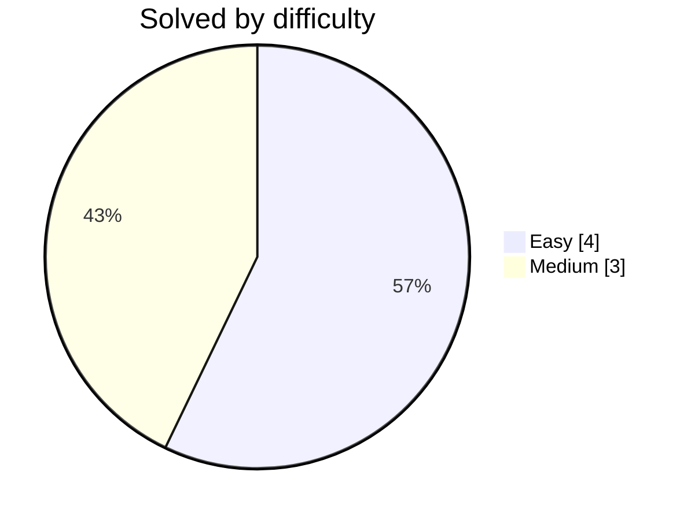

# 🐸 DwijeshD's Coding Solutions

**Accepted submissions, auto-committed by [LeetFrog](https://github.com/DwijeshD/LeetFrog)** 🐸

  
  

  
  
  

  

  
  
  
  

## 🟠 LeetCode  ·  7

| # | Problem | Difficulty | Language | Commit | Synced |
|:--:|:--|:--:|:--:|:--:|:--:|
| 1 | **[Roman to Integer](leetcode/roman-to-integer/)** |  |  | [latest](https://github.com/DwijeshD/leetcode-solutions) | `2026-08-13` |
| 2 | **[Container With Most Water](leetcode/container-with-most-water/)** |  |  | [`b703e48`](https://github.com/DwijeshD/leetcode-solutions/commit/b703e48562d548e73822e865e020ba7958305bf4) | `2026-08-13` |
| 3 | **[Add Two Numbers](leetcode/add-two-numbers/)** |  |  | [`432e760`](https://github.com/DwijeshD/leetcode-solutions/commit/432e760053c9c62bf76939ad9ea825b0ac99b31d) | `2026-08-13` |
| 4 | **[Two Sum](leetcode/two-sum/)** |  |  | [`457731e`](https://github.com/DwijeshD/leetcode-solutions/commit/457731ef8123ada0a21a01a4848c60d1ffbcfb9d) | `2026-08-13` |
| 5 | **[Palindrome Number](leetcode/palindrome-number/)** |  |  | [`d5151f4`](https://github.com/DwijeshD/leetcode-solutions/commit/d5151f451a3f1eb20c5dc08f4e7cde4e5524c717) | `2026-08-13` |
| 6 | **[Longest Substring Without Repeating Characters](leetcode/longest-substring-without-repeating-characters/)** |  |  | [`8566bf9`](https://github.com/DwijeshD/leetcode-solutions/commit/8566bf96cfbf0f8b8ddb294eae4569bbcd08462d) | `2026-08-13` |
| 7 | **[Concatenation of Array](leetcode/concatenation-of-array/)** |  |  | [`efa04fe`](https://github.com/DwijeshD/leetcode-solutions/commit/efa04fe754ffad65052096de5022dc41b5dab294) ↺5 | `2026-08-13` |

---

Updated automatically on every accepted submission · <a href="https://github.com/DwijeshD/LeetFrog">LeetFrog</a> 🐸

