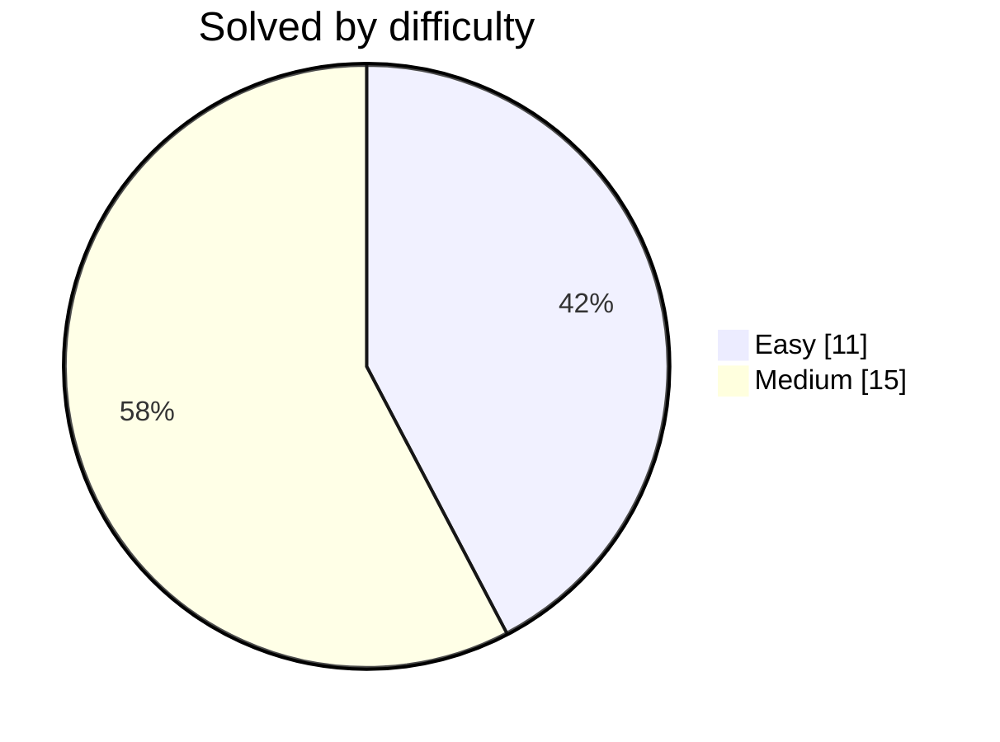

# 🐸 DwijeshD's Coding Solutions

**Accepted submissions, auto-committed by [LeetFrog](https://github.com/DwijeshD/LeetFrog)** 🐸

  
  

  
  
  

  

  
  
  
  

## 🟠 LeetCode  ·  27

| # | Problem | Difficulty | Language | Commit | Synced |
|:--:|:--|:--:|:--:|:--:|:--:|
| 1 | **[Product of Array Except Self](https://github.com/DwijeshD/leetcode-solutions/tree/main/leetcode/238-product-of-array-except-self)** |  |  | [latest](https://github.com/DwijeshD/leetcode-solutions) | `2026-08-24` |
| 2 | **[Reverse Linked List](https://github.com/DwijeshD/leetcode-solutions/tree/main/leetcode/206-reverse-linked-list)** |  |  | [`e0c9742`](https://github.com/DwijeshD/leetcode-solutions/commit/e0c9742697be3de881d259f7243ad8e094b89833) | `2026-08-24` |
| 3 | **[Isomorphic Strings](https://github.com/DwijeshD/leetcode-solutions/tree/main/leetcode/205-isomorphic-strings)** |  |  | [`5f15ec3`](https://github.com/DwijeshD/leetcode-solutions/commit/5f15ec3b3b39a2918b39d94830aa8a727d3d7d78) | `2026-08-24` |
| 4 | **[Add Two Numbers](https://github.com/DwijeshD/leetcode-solutions/tree/main/leetcode/2-add-two-numbers)** |  |  | [`7818fc7`](https://github.com/DwijeshD/leetcode-solutions/commit/7818fc787dfa9e98970b40ce8bf5b3697da13e43) | `2026-08-24` |
| 5 | **[Concatenation of Array](https://github.com/DwijeshD/leetcode-solutions/tree/main/leetcode/1929-concatenation-of-array)** |  |  | [`b6956e0`](https://github.com/DwijeshD/leetcode-solutions/commit/b6956e02feb0cf52e33ce70e63398a3475ea890b) ↺5 | `2026-08-24` |
| 6 | **[Widest Vertical Area Between Two Points Containing No Points](https://github.com/DwijeshD/leetcode-solutions/tree/main/leetcode/1637-widest-vertical-area-between-two-points-containing-no-points)** |  |  | [`c845eb6`](https://github.com/DwijeshD/leetcode-solutions/commit/c845eb6152e7d2bb15c9ef8280d112a2e6a48dd2) | `2026-08-24` |
| 7 | **[Reorder List](https://github.com/DwijeshD/leetcode-solutions/tree/main/leetcode/143-reorder-list)** |  |  | [`f4de16b`](https://github.com/DwijeshD/leetcode-solutions/commit/f4de16bfe56ef988473a127dd26ed94a4d620df1) | `2026-08-24` |
| 8 | **[Linked List Cycle](https://github.com/DwijeshD/leetcode-solutions/tree/main/leetcode/141-linked-list-cycle)** |  |  | [`ec8b6fb`](https://github.com/DwijeshD/leetcode-solutions/commit/ec8b6fb7699b9c4dd6aa229ad27f6b9cf05463af) | `2026-08-24` |
| 9 | **[Longest Common Prefix](https://github.com/DwijeshD/leetcode-solutions/tree/main/leetcode/14-longest-common-prefix)** |  |  | [`54690e6`](https://github.com/DwijeshD/leetcode-solutions/commit/54690e671262f2e0eb974f47713c3dfde8d370d6) | `2026-08-24` |
| 10 | **[Copy List with Random Pointer](https://github.com/DwijeshD/leetcode-solutions/tree/main/leetcode/138-copy-list-with-random-pointer)** |  |  | [`f018bdd`](https://github.com/DwijeshD/leetcode-solutions/commit/f018bdd46121d2c5b9525950a3cfb601a29c9b91) | `2026-08-24` |
| 11 | **[Roman to Integer](https://github.com/DwijeshD/leetcode-solutions/tree/main/leetcode/13-roman-to-integer)** |  |  | [`a9d5bed`](https://github.com/DwijeshD/leetcode-solutions/commit/a9d5bed507d08d12d9abfa6f67f6dfa2260deaff) | `2026-08-24` |
| 12 | **[Sequential Digits](https://github.com/DwijeshD/leetcode-solutions/tree/main/leetcode/1291-sequential-digits)** |  |  | [`06e6d1e`](https://github.com/DwijeshD/leetcode-solutions/commit/06e6d1ec5b8160a33e32df4b403dbf322b59ed70) | `2026-08-24` |
| 13 | **[Container With Most Water](https://github.com/DwijeshD/leetcode-solutions/tree/main/leetcode/11-container-with-most-water)** |  |  | [`7bd2daa`](https://github.com/DwijeshD/leetcode-solutions/commit/7bd2daa5df400cd6642bc4d81e5e4a483fbbfcfe) | `2026-08-24` |
| 14 | **[Binary Tree Zigzag Level Order Traversal](https://github.com/DwijeshD/leetcode-solutions/tree/main/leetcode/103-binary-tree-zigzag-level-order-traversal)** |  |  | [`fc0b02f`](https://github.com/DwijeshD/leetcode-solutions/commit/fc0b02f439c27bbbf3dd33c1675ff65cec1623a0) | `2026-08-24` |
| 15 | **[Binary Tree Level Order Traversal](https://github.com/DwijeshD/leetcode-solutions/tree/main/leetcode/102-binary-tree-level-order-traversal)** |  |  | [`14dc32b`](https://github.com/DwijeshD/leetcode-solutions/commit/14dc32b4dc31eb179231cae8a303a7b2fc852b02) ↺22 | `2026-08-24` |
| 16 | **[Two Sum](https://github.com/DwijeshD/leetcode-solutions/tree/main/leetcode/1-two-sum)** |  |  | [`0c86b3a`](https://github.com/DwijeshD/leetcode-solutions/commit/0c86b3a929753775502c401b0b4ac64b5d2d55e3) ↺6 | `2026-08-24` |
| 17 | **[Remove Element](https://github.com/DwijeshD/leetcode-solutions/tree/main/leetcode/remove-element)** |  |  | [`fbcf303`](https://github.com/DwijeshD/leetcode-solutions/commit/fbcf303eedf8089b385780dbb169d509f73edff2) | `2026-08-23` |
| 18 | **[Subarray Sum Equals K](https://github.com/DwijeshD/leetcode-solutions/tree/main/leetcode/560-subarray-sum-equals-k)** |  |  | [`bd5136b`](https://github.com/DwijeshD/leetcode-solutions/commit/bd5136bbf08c2841fa800baa396b2050dc66a53c) ↺3 | `2026-08-20` |
| 19 | **[Word Pattern](https://github.com/DwijeshD/leetcode-solutions/tree/main/leetcode/290-word-pattern)** |  |  | [`6bcd499`](https://github.com/DwijeshD/leetcode-solutions/commit/6bcd499a6a5d91ac6895de1e57fba8e63b6e78cc) ↺69 | `2026-08-18` |
| 20 | **[Koko Eating Bananas](https://github.com/DwijeshD/leetcode-solutions/tree/main/leetcode/875-koko-eating-bananas)** |  |  | [`169b9db`](https://github.com/DwijeshD/leetcode-solutions/commit/169b9db7d0e6041b6f9149537ee0814381fdff1f) | `2026-08-13` |
| 21 | **[Binary Search](https://github.com/DwijeshD/leetcode-solutions/tree/main/leetcode/704-binary-search)** |  |  | [`a181434`](https://github.com/DwijeshD/leetcode-solutions/commit/a1814347ddae80c683de74eed6951d658817df80) | `2026-08-13` |
| 22 | **[Top K Frequent Elements](https://github.com/DwijeshD/leetcode-solutions/tree/main/leetcode/347-top-k-frequent-elements)** |  |  | [`285c2bf`](https://github.com/DwijeshD/leetcode-solutions/commit/285c2bfa6e4921615385d18a7bcd09065e149203) | `2026-08-13` |
| 23 | **[Group Anagrams](https://github.com/DwijeshD/leetcode-solutions/tree/main/leetcode/49-group-anagrams)** |  |  | [`7af443f`](https://github.com/DwijeshD/leetcode-solutions/commit/7af443fffd38318a1fed1d40d2722af3f52249a0) | `2026-08-13` |
| 24 | **[Find First and Last Position of Element in Sorted Array](https://github.com/DwijeshD/leetcode-solutions/tree/main/leetcode/34-find-first-and-last-position-of-element-in-sorted-array)** |  |  | [`a2e2b5d`](https://github.com/DwijeshD/leetcode-solutions/commit/a2e2b5d218900461df80aa8ecef34882a496916f) | `2026-08-13` |
| 25 | **[Search in Rotated Sorted Array](https://github.com/DwijeshD/leetcode-solutions/tree/main/leetcode/33-search-in-rotated-sorted-array)** |  |  | [`38d34fc`](https://github.com/DwijeshD/leetcode-solutions/commit/38d34fc8bf1aab7210b3807243eb75ffba8310d2) | `2026-08-13` |
| 26 | **[Palindrome Number](https://github.com/DwijeshD/leetcode-solutions/tree/main/leetcode/9-palindrome-number)** |  |  | [`d5151f4`](https://github.com/DwijeshD/leetcode-solutions/commit/d5151f451a3f1eb20c5dc08f4e7cde4e5524c717) | `2026-08-13` |
| 27 | **[Longest Substring Without Repeating Characters](https://github.com/DwijeshD/leetcode-solutions/tree/main/leetcode/3-longest-substring-without-repeating-characters)** |  |  | [`8566bf9`](https://github.com/DwijeshD/leetcode-solutions/commit/8566bf96cfbf0f8b8ddb294eae4569bbcd08462d) | `2026-08-13` |

---

Updated automatically on every accepted submission · <a href="https://github.com/DwijeshD/LeetFrog">LeetFrog</a> 🐸

