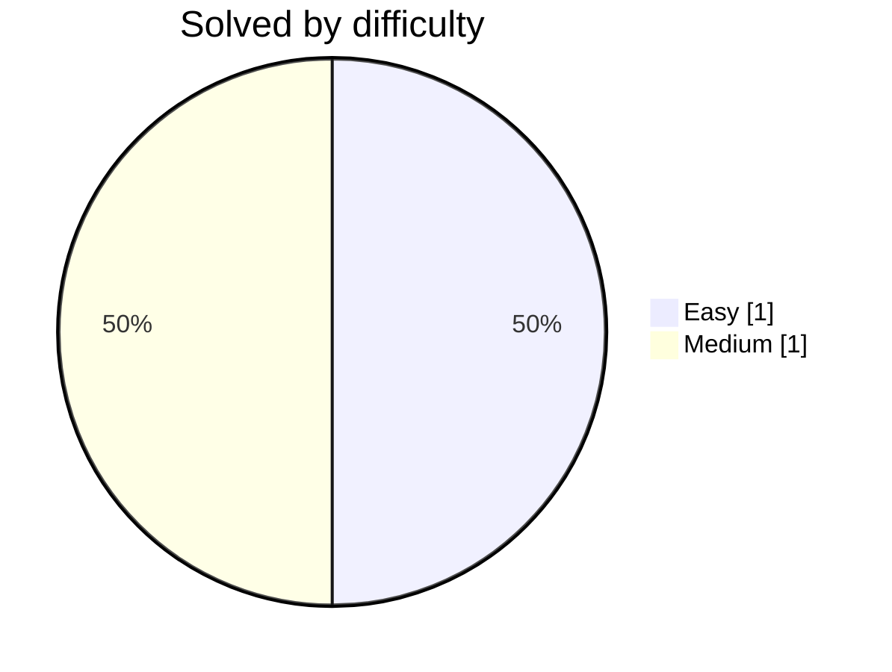

# 🐸 DwijeshD's Coding Solutions

**Accepted submissions, auto-committed by [LeetFrog](https://github.com/DwijeshD/LeetFrog)** 🐸

  
  

  
  
  

  

  
  
  
  

## 🟠 LeetCode  ·  2

| # | Problem | Difficulty | Language | Commit | Synced |
|:--:|:--|:--:|:--:|:--:|:--:|
| 1 | **[Longest Substring Without Repeating Characters](leetcode/longest-substring-without-repeating-characters/)** |  |  | [latest](https://github.com/DwijeshD/leetcode-solutions) | `2026-08-13` |
| 2 | **[Concatenation of Array](leetcode/concatenation-of-array/)** |  |  | [`efa04fe`](https://github.com/DwijeshD/leetcode-solutions/commit/efa04fe754ffad65052096de5022dc41b5dab294) ↺5 | `2026-08-13` |

---

Updated automatically on every accepted submission · <a href="https://github.com/DwijeshD/LeetFrog">LeetFrog</a> 🐸

