# Two Sum  ·  Easy

> Leetcode · [Open problem](https://leetcode.com/problems/two-sum) · synced 2026-08-24

**Language:** python3
**Topics:** Array, Hash Table
**Size:** 9 lines · 278 chars
**Revisions:** 4

## Complexity

- **Time:** O(n) — single pass through the array with O(1) hash map operations
- **Space:** O(n) — stores up to n elements in the hash map

## How it works



## Solution

See [`Solution.py`](./Solution.py).

```python
class Solution:
    def twoSum(self, nums: list[int], target: int) -> list[int]:
        seen = {}
        for i, n in enumerate(nums):
            if target - n in seen:
                return [seen[target - n], i]
            seen[n] = i
        return []
# run-1787530307972

```
