# Binary Tree Level Order Traversal  ·  Medium

> Leetcode · [Open problem](https://leetcode.com/problems/binary-tree-level-order-traversal) · synced 2026-08-16

**Language:** python3
**Topics:** Tree, Breadth-First Search, Binary Tree
**Size:** 16 lines · 362 chars
**Revisions:** 12

## Complexity

- **Time:** O(n) — each node is visited once in the BFS loop
- **Space:** O(w) — the queue holds at most one level of nodes (width w)

## How it works



## Solution

See [`Solution.py`](./Solution.py).

```python

    def levelOrder(self, root: Optional[TreeNode]) -> List[List
    [int]]:
        if not root:
            return []
        
        queue = deque([])
        queue.append(root)

        result = []

        while queue:
            level = []
            level_size = len(queue)
            for _ in range(level_size):
                node = queue.popleft()
```
