# Binary Tree Zigzag Level Order Traversal  ·  Medium

> Leetcode · [Open problem](https://leetcode.com/problems/binary-tree-zigzag-level-order-traversal) · synced 2026-08-24

**Language:** python3
**Topics:** Tree, Breadth-First Search, Binary Tree
**Size:** 16 lines · 399 chars

## Complexity

- **Time:** O(n) — each node is visited once in the BFS loop
- **Space:** O(n) — the queue can contain up to the width of the tree (worst‑case all nodes)

## How it works



## Solution

See [`Solution.py`](./Solution.py).

```python


        while queue:
            level = []
            level_size = len(queue)

            for _ in range(level_size):
                node = queue.popleft()
                level.append(node.val)

                if node.left:
                    queue.append(node.left)
                if node.right:
                    queue.append(node.right)
                
            if not start_left:
```
