# Container With Most Water

> Leetcode · synced 2026-08-24

**Language:** python3
**Size:** 15 lines · 346 chars

## Complexity

- **Time:** O(n) — one pass, two pointers close in from both ends
- **Space:** O(1) — only left/right/best tracked

## How it works



## Solution

See [`Solution.py`](./Solution.py).

```python

class Solution:
    def maxArea(self, height: List[int]) -> int:

        left = 0
        right = len(height)-1
        max_area = 0

        while left < right:

            area = (right-left) * min(height[left], height[right])
            max_area = max(max_area, area)

            if height[left] < height[right]:
                left += 1
```
