# Sequential Digits

> Leetcode · synced 2026-08-24

**Language:** python3
**Size:** 15 lines · 549 chars

## Complexity

- **Time:** O(1) — at most 9 possible window lengths over 9 digits
- **Space:** O(1) — output size is bounded by a small constant

## How it works



## Solution

See [`Solution.py`](./Solution.py).

```python

class Solution:
    def sequentialDigits(self, low: int, high: int) -> List[int]:

        # nums = [1, 2, 3, 4, 5, 6, 7, 8, 9, 12, 23, 34, 45, 56, 
        67 ,78, 89, 123, 234, 345, 456, 567, 678, 789, 1234, 
        2345, 3456, 4567, 5678, 6789, 12345, 23456, 34567, 45678, 
        56789, 123456, 234567, 345678, 456789, 1234567, 2345678, 
        3456789, 12345678, 23456789, 123456789]

        # answer = []

        # for i in range(len(nums)):
        #     if (nums[i] <= high) & (nums[i] >= low):
        #         answer.append(nums[i])
```
