# Roman to Integer

> Leetcode · synced 2026-08-24

**Language:** python3
**Size:** 14 lines · 254 chars

## Complexity

- **Time:** O(n) — single left-to-right scan of the string
- **Space:** O(1) — fixed symbol-to-value lookup table

## How it works



## Solution

See [`Solution.py`](./Solution.py).

```python

class Solution:
    def romanToInt(self, s: str) -> int:
        values = {
            "I": 1,
            "V": 5,
            "X": 10,
            "L": 50,
            "C": 100,
            "D": 500,
            "M": 1000
        }

        total = 0

```
