# Copy List with Random Pointer

> Leetcode · synced 2026-08-24

**Language:** python3
**Size:** 14 lines · 303 chars

## Complexity

- **Time:** O(n) — three linear passes over the list
- **Space:** O(1) extra — no hash map, clones interleaved in place

## How it works



## Solution

See [`Solution.py`](./Solution.py).

```python

"""
# Definition for a Node.
class Node:
    def __init__(self, x: int, next: 'Node' = None, random: 
    'Node' = None):
        self.val = int(x)
        self.next = next
        self.random = random
"""

class Solution:
    def copyRandomList(self, head: 'Optional[Node]') -> 'Optional
    [Node]':

```
