# Longest Common Prefix

> Leetcode · synced 2026-08-24

**Language:** python3
**Size:** 12 lines · 310 chars

## Complexity

- **Time:** O(S) — S is the sum of all characters across strings
- **Space:** O(1) — prefix reuses input character data

## How it works



## Solution

See [`Solution.py`](./Solution.py).

```python
class Solution:
    def longestCommonPrefix(self, strs: List[str]) -> str:
        prefix = strs[0]

        for i in range(1, len(strs)):
            while not strs[i].startswith(prefix):
                prefix = prefix[:-1]

                if not prefix:
                    return ""

        return prefix
```
