# Linked List Cycle

> Leetcode · synced 2026-08-24

**Language:** python3
**Size:** 15 lines · 350 chars

## Complexity

- **Time:** O(n) — Floyd's algorithm, fast pointer bounds the loop
- **Space:** O(1) — only two pointers, no extra structure

## How it works



## Solution

See [`Solution.py`](./Solution.py).

```python

# Definition for singly-linked list.
# class ListNode:
#     def __init__(self, x):
#         self.val = x
#         self.next = None

class Solution:
    def hasCycle(self, head: Optional[ListNode]) -> bool:   

        slow = head
        fast = head
        while fast and fast.next:
            slow = slow.next
            fast = fast.next.next
```
