# Widest Vertical Area Between Two Points Containing No Points

> Leetcode · synced 2026-08-24

**Language:** python3
**Size:** 14 lines · 350 chars

## Complexity

- **Time:** O(n log n) — dominated by the sort
- **Space:** O(log n) to O(n) — sort's own working space

## How it works



## Solution

See [`Solution.py`](./Solution.py).

```python

class Solution:
    def maxWidthOfVerticalArea(self, points: List[List[int]]) -> 
    int:

        sorted_points = sorted(points, key=lambda x: x)
        max_gap = 0

        for i in range(len(sorted_points) - 1):
            gap = sorted_points[i][0] - sorted_points[i+1][0]
            max_gap = max(abs(gap), max_gap)

        return max_gap


```
