# Two Sum II - Input Array Is Sorted  ·  Medium

> Leetcode · [Open problem](https://leetcode.com/problems/two-sum-ii-input-array-is-sorted) · synced 2026-09-27

**Language:** python3
**Topics:** Array, Two Pointers, Binary Search
**Size:** 25 lines · 732 chars

## Performance

| Metric | Value | Beats |
| --- | --- | --- |
| Runtime | 67 ms | 9.05% |
| Memory | 22.52 MB | 9.68% |

## Complexity

- **Time:** O(n) — each step moves either the lower or upper pointer inward, scanning at most n elements
- **Space:** O(1) — constant extra space using only two pointer variables

## How it works



## Solution

See [`Solution.py`](./Solution.py).

```python
class Solution:
    def twoSum(self, numbers: list[int], target: int) -> list[int]:

        # for i in range(len(numbers)):
        #     for j in range(len(numbers)):
        #         if ((numbers[i] + numbers[j]) == target) and (i < j) and (j <= len(numbers)):
        #             return [i+1,j+1]

        # numbers = [1,2,3,4,5,6,7,8,9] target = 7

        lower = 0
        upper = len(numbers) -1

        while lower <= upper:
            print(lower, upper)
            total = numbers[lower] + numbers[upper]

            if total == target:
                return [lower + 1, upper + 1]

            if total > target:
                upper -= 1
            if total <  target:
                lower += 1
            

```
