# Isomorphic Strings

> Leetcode · synced 2026-08-24

**Language:** python3
**Size:** 21 lines · 495 chars

## Complexity

- **Time:** O(n) — single pass with O(1) hash-map lookups
- **Space:** O(1) — at most 26 letters in each map

## How it works



## Solution

See [`Solution.py`](./Solution.py).

```python
class Solution:
    def isIsomorphic(self, s: str, t: str) -> bool:

        if len(s) != len(t):
            return False

        s_map = {}
        t_map = {}

        for char1, char2 in zip(s, t):
            if char1 in s_map and s_map[char1] != char2:
                return False
            if char2 in t_map and t_map[char2] != char1:
                return False
            
            s_map[char1] = char2
            t_map[char2] = char1

        return True
            
        
```
