# Reverse Linked List

> Leetcode · synced 2026-08-24

**Language:** python3
**Size:** 15 lines · 345 chars

## Complexity

- **Time:** O(n) — one pass, each node visited once
- **Space:** O(1) — three pointers, no recursion stack

## How it works



## Solution

See [`Solution.py`](./Solution.py).

```python

# Definition for singly-linked list.
# class ListNode:
#     def __init__(self, val=0, next=None):
#         self.val = val
#         self.next = next
class Solution:
    def reverseList(self, head: Optional[ListNode]) -> Optional
    [ListNode]:

        prev = None
        current = head

        print("START")
        print("prev =", prev)
```
