# Product of Array Except Self

> Leetcode · synced 2026-08-24

**Language:** python3
**Size:** 14 lines · 398 chars

## Complexity

- **Time:** O(n) — two linear passes, no division
- **Space:** O(1) extra — output array doesn't count

## How it works



## Solution

See [`Solution.py`](./Solution.py).

```python

class Solution:
    def productExceptSelf(self, nums: List[int]) -> List[int]:
        answer = []
        left_total = 1
        right_total = 1

        for i in range(len(nums)):
            answer.append(left_total)
            left_total = left_total * nums[i]

        for i in range(len(nums) - 1, -1, -1):
            answer[i] = answer[i] * right_total
            right_total *= nums[i]

```
