# Word Pattern

> Leetcode · synced 2026-08-24

**Language:** python3
**Size:** 14 lines · 150 chars
**Revisions:** 69

## Complexity

- **Time:** O(n) — one pass, O(1) hash-map operations
- **Space:** O(k) — k distinct pattern letters / words stored

## How it works



## Solution

See [`Solution.py`](./Solution.py).

```python

                return False

            char_to_word[char] = word
            word_to_char[word] = char

        return True

        


        
```
