# Longest Substring Without Repeating Characters  ·  Medium

> Leetcode · [Open problem](https://leetcode.com/problems/longest-substring-without-repeating-characters) · synced 2026-08-24

**Language:** python3
**Topics:** Hash Table, String, Sliding Window
**Size:** 15 lines · 307 chars

## Complexity

- **Time:** O(n) — each character is visited at most twice by the sliding‑window
- **Space:** O(min(n, |charset|)) — the `seen` set holds at most one entry per distinct character

## How it works



## Solution

See [`Solution.py`](./Solution.py).

```python

class Solution:
    def lengthOfLongestSubstring(self, s: str) -> int:

        # sliding window
        left = 0
        right = 0
        seen = set()
        best = 0

        for right in range(len(s)):

            while s[right] in seen:
                seen.remove(s[left])
                left += 1
```
