# Search in Rotated Sorted Array

> Leetcode · synced 2026-08-24

**Language:** python3
**Size:** 15 lines · 375 chars

## Complexity

- **Time:** O(log n) — binary search, halving the search space
- **Space:** O(1) — three index variables

## How it works



## Solution

See [`Solution.py`](./Solution.py).

```python

class Solution:
    def search(self, nums: List[int], target: int) -> int:
        n = len(nums)
        rot = bisect_left(nums, True, key=lambda n: n <= nums[-1])
        
        lo, hi = 0, n - 1

        while lo <= hi:
            mid = (lo + hi) // 2
            real = (mid + rot) % n

            if nums[real] == target:
                return real
                
```
