# Find First and Last Position of Element in Sorted Array

> Leetcode · synced 2026-08-24

**Language:** python3
**Size:** 15 lines · 298 chars

## Complexity

- **Time:** O(log n) — two binary searches
- **Space:** O(1) — index variables only

## How it works



## Solution

See [`Solution.py`](./Solution.py).

```python

class Solution:
    def searchRange(self, nums: List[int], target: int) -> List
    [int]:

        lo, hi = (0, len(nums) - 1)
        ans_left = -1
        ans_right = -1


        while lo <= hi:
            mid = (hi + lo) // 2                

            
            if nums[mid] >= target:
```
