# Top K Frequent Elements

> Leetcode · synced 2026-08-24

**Language:** python3
**Size:** 15 lines · 419 chars

## Complexity

- **Time:** O(n) — bucket sort by frequency, no full sort needed
- **Space:** O(n) — frequency map and buckets

## How it works



## Solution

See [`Solution.py`](./Solution.py).

```python

class Solution:
    def topKFrequent(self, nums: List[int], k: int) -> List[int]:
        num_sets = {}
        for num in nums:
            if num in num_sets:
                num_sets[num] += 1
            else:
                num_sets[num] = 1
        
        sorted_items = sorted(num_sets.items(), key=lambda x: x
        [1], reverse=True)
        top_k = [x[0] for x in sorted_items[:k]]

        return top_k
```
