# Group Anagrams

> Leetcode · synced 2026-08-24

**Language:** python3
**Size:** 15 lines · 359 chars

## Complexity

- **Time:** O(n · k log k) — k = max string length, for the sort key
- **Space:** O(n · k) — grouped strings stored in the map

## How it works



## Solution

See [`Solution.py`](./Solution.py).

```python

class Solution:
    def groupAnagrams(self, strs: List[str]) -> List[List[str]]:
        keys = {}

        for i in range(len(strs)):
            word = strs[i]
            key = "".join(sorted(word))

            if key in keys:
                keys[key].append(word)
            else:
                keys[key] = [word]

        return list(keys.values())
```
