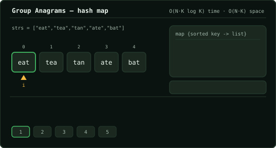

# Group Anagrams  ·  Medium

> Leetcode · [Open problem](https://leetcode.com/problems/group-anagrams) · synced 2026-09-27

**Language:** python3
**Topics:** Array, Hash Table, String, Sorting
**Size:** 3 lines · 89 chars
**Revisions:** 2

## Performance

| Metric | Value | Beats |
| --- | --- | --- |
| Runtime | 11 ms | 82.83% |
| Memory | 21.67 MB | 97.78% |

## Complexity

- **Time:** O(N * K log K) — where N is the number of strings and K is the maximum string length, sorting each string to form the key
- **Space:** O(N * K) — storing all strings and their sorted keys in the hash map

## How it works



## Solution

See [`Solution.py`](./Solution.py).

```python
class Solution:
    def groupAnagrams(self, strs: list[str]) -> list[list[str]]:
        
```
