# Longest Palindromic Substring  ·  Medium

> Leetcode · [Open problem](https://leetcode.com/problems/longest-palindromic-substring) · synced 2026-09-27

**Language:** python3
**Topics:** Two Pointers, String, Dynamic Programming, Manacher
**Size:** 3 lines · 72 chars

## Complexity

- **Time:** O(n^2) — expanding around each of the 2n-1 centers takes up to O(n) time
- **Space:** O(1) — only pointer variables and boundary indices are stored

## How it works



## Solution

See [`Solution.py`](./Solution.py).

```python
class Solution:
    def longestPalindrome(self, s: str) -> str:
        
```
