# Subarray Sum Equals K

> Leetcode · synced 2026-08-24

**Language:** python3
**Size:** 15 lines · 375 chars
**Revisions:** 3

## Complexity

- **Time:** O(n) — one pass with a running prefix-sum hash map
- **Space:** O(n) — prefix-sum counts stored in the map

## How it works



## Solution

See [`Solution.py`](./Solution.py).

```python

class Solution:
    def subarraySum(self, nums: List[int], k: int) -> int:
        map = {0: 1}
        prefix = 0
        counter = 0

        for i in range(len(nums)):
            prefix += nums[i]
            needed = prefix - k
            if needed in map:
                counter += map[needed]
            map[prefix] = map.get(prefix, 0) + 1

        return counter
```
