# Binary Search

> Leetcode · synced 2026-08-24

**Language:** python3
**Size:** 15 lines · 378 chars

## Complexity

- **Time:** O(log n) — search space halves each step
- **Space:** O(1) — lo/hi/mid only

## How it works



## Solution

See [`Solution.py`](./Solution.py).

```python

class Solution:
    def search(self, nums: List[int], target: int) -> int:
        
        lo = 0
        hi = len(nums) -1

        while lo <= hi:
            mid = (lo + hi) // 2
            if nums[mid] == target:
                return mid
            elif target > nums[mid]:
                lo = mid + 1
            elif target < nums[mid]:
                hi = mid - 1
```
