# Koko Eating Bananas

> Leetcode · synced 2026-08-24

**Language:** python3
**Size:** 15 lines · 319 chars

## Complexity

- **Time:** O(n log m) — n piles scanned per binary-search step over m = max pile
- **Space:** O(1) — no extra structure beyond the search bounds

## How it works



## Solution

See [`Solution.py`](./Solution.py).

```python

class Solution:
    def minEatingSpeed(self, piles: List[int], h: int) -> int:

        lo = 1
        hi = max(piles)
        answer = hi


        while lo <= hi:
            mid = (lo + hi) // 2
            hours = 0
            
            for j in range(len(piles)):
                hours += ceil(piles[j] / mid)
```
