# Remove Element

> Leetcode · synced 2026-08-24

**Language:** python3
**Size:** 10 lines · 234 chars

## Complexity

- **Time:** O(n) — one pass, in-place overwrite
- **Space:** O(1) — no extra array

## How it works



## Solution

See [`Solution.py`](./Solution.py).

```python
class Solution:
    def removeElement(self, nums: List[int], val: int) -> int:
        k = 0

        for i in range(len(nums)):
            if nums[i] != val:
                nums[k] = nums[i]
                k += 1

        return k
```
